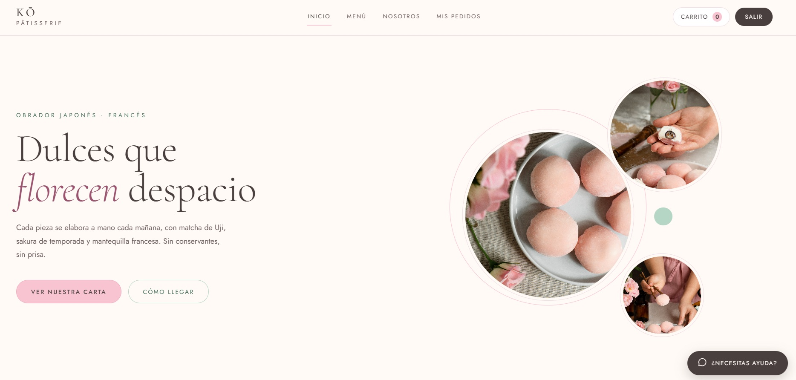
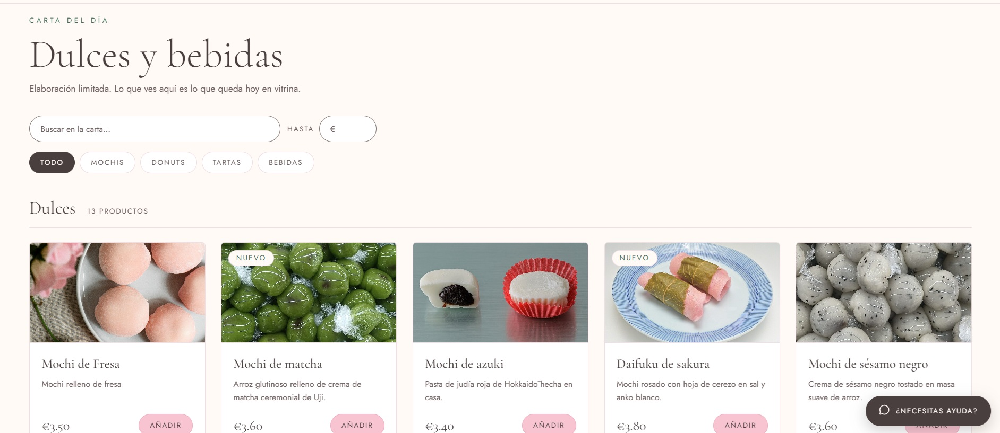
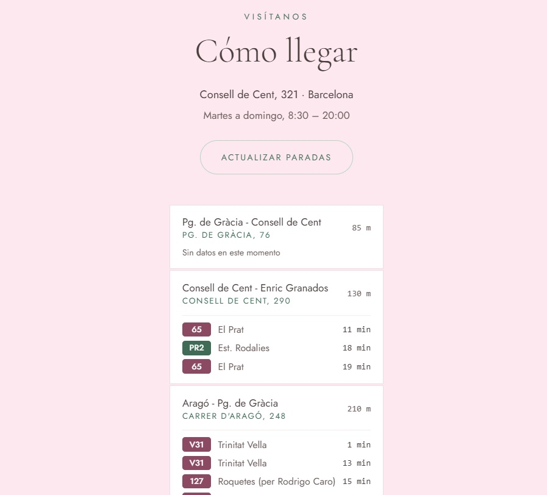
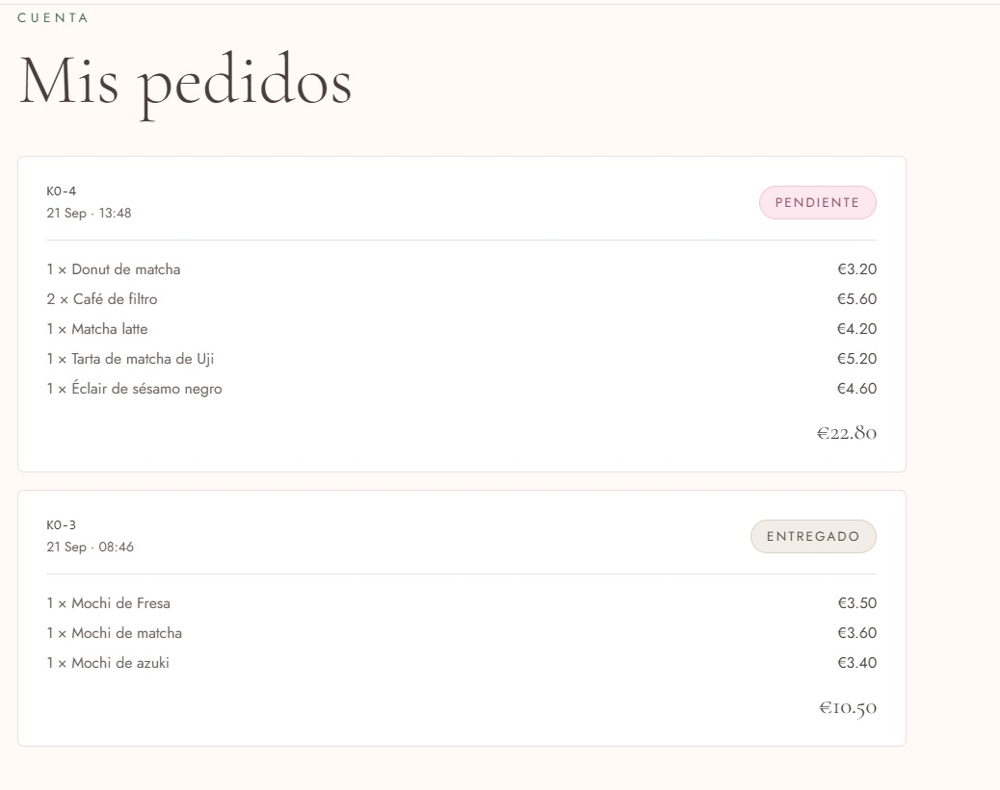
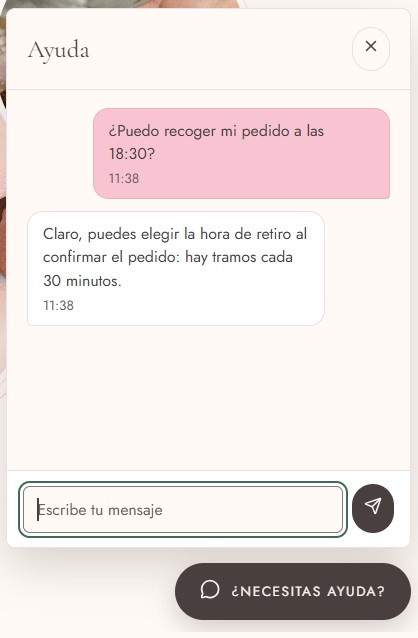
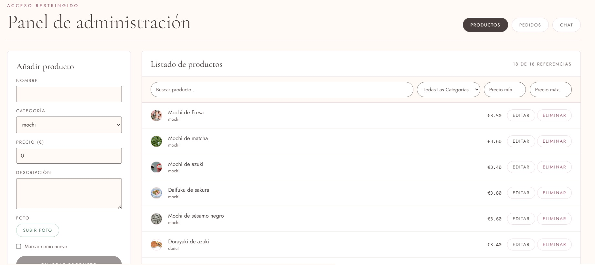
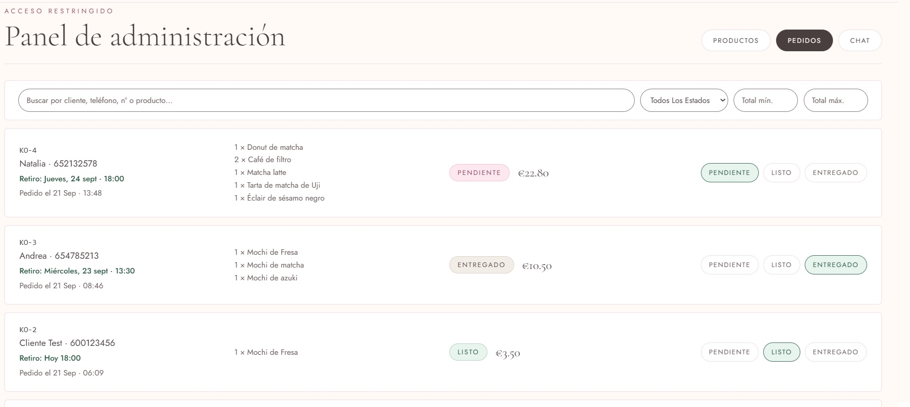
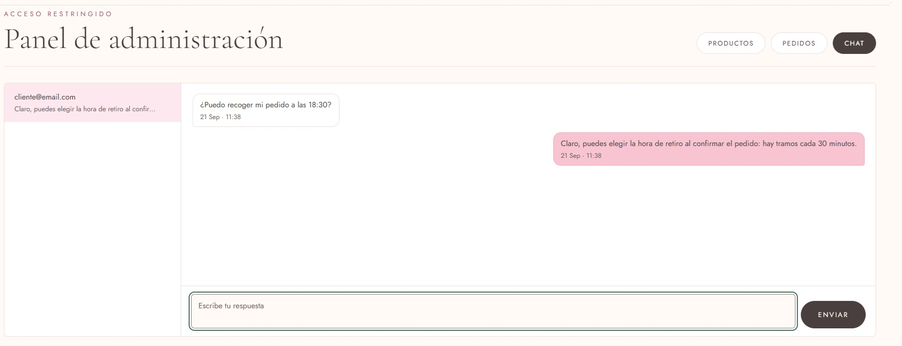
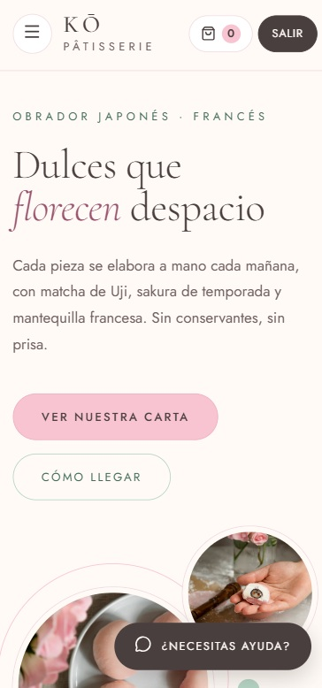

# KŌ Pâtisserie

Aplicación web de una pastelería japonesa-francesa: los clientes consultan la carta, hacen pedidos para **recoger en tienda** eligiendo día y hora, siguen el estado de sus pedidos y hablan con la tienda por un **chat de ayuda**; la tienda gestiona productos, pedidos y conversaciones desde un **panel de administración**. Todo lo que cambia (estado de un pedido, mensajes del chat, pedidos nuevos) llega **en tiempo real** por WebSocket.

Es un monorepo con dos aplicaciones:

- **`ko_front`**: interfaz en **Angular 21** (componentes standalone y signals).
- **`ko_back`**: API en **FastAPI** con **PostgreSQL**.

---

## Índice

1. [Capturas](#capturas)
2. [Qué puede hacer](#qué-puede-hacer)
3. [Tecnologías](#tecnologías)
4. [Arquitectura](#arquitectura)
5. [Estructura del repositorio](#estructura-del-repositorio)
6. [Puesta en marcha](#puesta-en-marcha)
7. [Configuración](#configuración)
8. [Despliegue](#despliegue)
9. [API REST](#api-rest)
10. [Tiempo real (WebSocket)](#tiempo-real-websocket)
11. [Modelo de datos](#modelo-de-datos)
12. [Reglas de negocio](#reglas-de-negocio)
13. [Tests](#tests)
14. [Accesibilidad y diseño adaptable](#accesibilidad-y-diseño-adaptable)
15. [Documentación de diseño](#documentación-de-diseño)
16. [Forma de trabajo](#forma-de-trabajo)
17. [Limitaciones conocidas y siguientes pasos](#limitaciones-conocidas-y-siguientes-pasos)
18. [Créditos](#créditos)
19. [Contacto](#-contacto)

---

## Capturas

### Inicio



### Carta



### Cómo llegar



### Mis pedidos



### Chat de ayuda (cliente)



### Panel de administración: productos



### Panel de administración: pedidos



### Panel de administración: chat



### Diseño adaptable



---

## Qué puede hacer

### Cliente
- **Explorar la carta** por categorías (mochis, donuts, tartas, bebidas), con búsqueda y filtro de precio. Las tarjetas muestran la foto del producto o, si no la tiene, un icono de su categoría.
- **Carrito lateral** con cantidades, que se conserva al recargar la página. Cada tarjeta muestra cuántas unidades llevas de ese producto.
- **Hacer un pedido** para recoger en tienda: se elige el **día** (los próximos 7 días abiertos) y la **hora** (tramos de 30 minutos según el horario de la tienda), no se escribe a mano.
- **Ver sus pedidos** y su estado, actualizado en vivo.
- **Chat de ayuda** con la tienda, con historial guardado.
- **Cómo llegar**: paradas de autobús cercanas con los próximos pasos.
- **Registro e inicio de sesión**, con botones de acceso rápido a las cuentas de demostración.

### Administrador
- **Productos**: crear, editar y borrar, con **foto** (subida desde el propio formulario, con vista previa). Buscador, filtros por categoría y precio, y paginación.
- **Pedidos**: ver los pedidos con la hora de retiro, cambiar su estado, buscar por cliente, teléfono, número o producto, y filtrar por estado y por total. Los pedidos nuevos aparecen solos.
- **Chat**: una conversación por cliente, con contador de mensajes sin leer y respuesta en tiempo real. El administrador no ve el botón de ayuda ni el carrito, porque no los necesita.

### Transversal
- **Tiempo real** con un único WebSocket por usuario (chat y pedidos).
- **Accesibilidad WCAG 2.2 AA** y **diseño adaptable** de 320 px a pantallas de escritorio.

---

## Tecnologías

| Capa | Tecnología |
|---|---|
| Interfaz | Angular 21 (standalone, signals), RxJS, TypeScript 5.9, `lucide-angular` (iconos), SCSS |
| Tipografías | Cormorant Garamond y Jost (Google Fonts) |
| API | FastAPI, Pydantic, SQLAlchemy 2 (síncrono), Alembic |
| Base de datos | PostgreSQL 16 (Docker) en local; SQLite en memoria en los tests; Neon (Postgres serverless) en producción |
| Autenticación | JWT (HS256, 7 días) y contraseñas con bcrypt |
| Tiempo real | WebSocket de Starlette / FastAPI |
| Tests | pytest + httpx (back); Vitest con `ng test` (front) |
| Gestor de paquetes | `uv` (Python) y `npm` (Node) |
| Datos externos | API iTransit de TMB (paradas y próximos autobuses) |
| Imágenes de productos | Cloudinary (subida, almacenamiento y CDN) |
| Despliegue | Render (Blueprint: web service + sitio estático) + Neon (PostgreSQL) |

---

## Arquitectura

```
┌────────────────────── Navegador (Angular) ──────────────────────┐
│  Páginas y componentes                                          │
│     ↕ signals                                                   │
│  Servicios: Auth · Product · Order · Cart · Chat · Bus          │
│  RealtimeService  ── único código que toca el WebSocket         │
└──────────┬──────────────────────────────┬───────────────────────┘
      HTTP + JWT                     WebSocket /ws
           │                              │
┌──────────▼──────────────────────────────▼───────────────────────┐
│  FastAPI                                                        │
│   api/   auth · products · orders · chat · uploads · ws         │
│   core/  config · seguridad (JWT) · dependencias · realtime     │
│   services/  lógica del chat        models/ schemas/            │
└───────────────────────────────┬─────────────────────────────────┘
                                │ SQLAlchemy + Alembic
                         ┌──────▼──────┐
                         │ PostgreSQL  │
                         └─────────────┘
```

**Cómo fluye la información**

- **Lecturas y escrituras normales** van por la API REST con el token JWT en la cabecera `Authorization`.
- **Tiempo real**: cada usuario con sesión abre **una sola conexión** `/ws`. El primer mensaje que envía es su token. Después el servidor le va enviando eventos (`chat.message`, `chat.read`, `order.created`, `order.updated`).
- **El historial del chat y las listas** se cargan por REST; el WebSocket solo empuja los cambios en vivo y transporta los mensajes que se envían.
- **Si la conexión se cae**, el front reintenta solo con espera creciente (de 1 s a 30 s) y, al volver, recarga lo que pudo perderse.
- El registro de conexiones está **en memoria del proceso**, así que el back debe ejecutarse con un único proceso de `uvicorn` (ver [limitaciones](#limitaciones-conocidas-y-siguientes-pasos)).

---

## Estructura del repositorio

```
ko_patisserie/
├── README.md                     Este documento
├── .gitignore                    Ignora dependencias, compilados, carpetas locales y environment.ts
├── docs/
│   ├── accessibility.md          Auditoría y guía de accesibilidad (WCAG 2.2 AA)
│   ├── capturas/                 Capturas de pantalla usadas en este README
│   └── superpowers/
│       ├── specs/                Documentos de diseño de cada funcionalidad
│       └── plans/                Planes de implementación de cada funcionalidad
├── ko_back/                      API (Python)
└── ko_front/                     Interfaz (Angular)
```

### `ko_back/` — API

```
ko_back/
├── pyproject.toml                Dependencias y versión mínima de Python (>= 3.13)
├── uv.lock                       Versiones exactas de las dependencias
├── docker-compose.yml            PostgreSQL 16 para desarrollo (puerto 5434)
├── alembic.ini                   Configuración de las migraciones
├── .env.example                  Plantilla de variables de entorno
├── alembic/
│   ├── env.py                    Conexión de Alembic con los modelos
│   └── versions/
│       ├── 0001_initial.py            Usuarios, productos y pedidos
│       ├── 0002_product_image_url.py  Foto opcional en los productos
│       └── 0003_chat_message.py       Mensajes del chat
├── app/
│   ├── main.py                   Crea la aplicación: CORS, routers, ficheros subidos y /health
│   ├── api/                      Endpoints (un fichero por recurso)
│   │   ├── auth.py                    Registro, login y usuario actual
│   │   ├── products.py                CRUD de productos
│   │   ├── orders.py                  Pedidos; publica los eventos en tiempo real
│   │   ├── chat.py                    Historial y lista de conversaciones (REST)
│   │   ├── uploads.py                 Subida de fotos de productos
│   │   ├── ws.py                      Endpoint WebSocket: autenticación, límites y reparto de mensajes
│   │   └── ws_chat.py                 Manejo de los mensajes de chat por WebSocket
│   ├── core/                     Piezas transversales
│   │   ├── config.py                  Ajustes leídos de variables de entorno
│   │   ├── database.py                Motor y sesiones de SQLAlchemy
│   │   ├── security.py                Hash de contraseñas y JWT
│   │   ├── deps.py                    Dependencias: usuario actual y exigir administrador
│   │   ├── origins.py                 Orígenes permitidos (CORS y WebSocket)
│   │   ├── pickup.py                  Validación del horario de retiro
│   │   └── realtime.py                Gestor de conexiones WebSocket
│   ├── models/                   Tablas (SQLAlchemy): user, product, order, chat
│   ├── schemas/                  Formas de entrada y salida (Pydantic)
│   ├── services/chat.py          Lógica del chat, compartida por REST y WebSocket
│   └── scripts/seed_admin.py     Crea las cuentas de demostración
├── tests/                        Tests (pytest), un fichero por área
└── uploads/                      Fotos subidas por el administrador (se crea sola; no se versiona)
```

### `ko_front/` — Interfaz

```
ko_front/
├── package.json                  Dependencias y scripts
├── angular.json                  Configuración de Angular (presupuestos de tamaño incluidos)
├── tsconfig*.json                Configuración de TypeScript (aplicación y tests)
├── public/                       Recursos estáticos servidos tal cual
│   ├── favicon.ico
│   ├── logo-ko.png                    Icono de la pestaña del navegador
│   └── images/
│       ├── daifuku.jpg, mochi.jpg,    Fotos de la portada
│       │   matcha.jpg, dulces-japoneses.jpg
│       └── products/                  Fotos de los productos y CREDITS.md (autoría y licencias)
└── src/
    ├── index.html                Página base (idioma y título)
    ├── main.ts                   Arranque
    ├── environments/             Configuración: environment.example.ts (plantilla) y environment.ts (local, no se versiona)
    ├── styles/
    │   ├── variables.scss             Paleta y medidas (colores accesibles)
    │   ├── mixins.scss                Mezclas y animaciones reutilizables
    │   └── styles.scss                Estilos globales, botones, formularios y utilidades
    └── app/
        ├── app.ts / app.routes.ts / app.config.ts   Componente raíz, rutas (con título por página) y proveedores
        ├── core/                 Lógica sin interfaz
        │   ├── guards/auth.guard.ts        Protege las rutas que exigen sesión
        │   ├── interceptors/auth.interceptor.ts   Añade el token a las peticiones
        │   ├── models/                     Tipos: producto, pedido, usuario, chat, eventos, paradas
        │   ├── services/
        │   │   ├── auth.service.ts             Sesión
        │   │   ├── product.service.ts          Productos y subida de fotos
        │   │   ├── order.service.ts            Pedidos
        │   │   ├── cart.service.ts             Carrito (se guarda en el navegador)
        │   │   ├── chat.service.ts             Estado del chat de cliente y de administrador
        │   │   ├── realtime.service.ts         WebSocket: conexión, reintentos y eventos
        │   │   ├── bus.service.ts              Paradas de autobús (TMB)
        │   │   └── token-storage.ts            Guarda el token
        │   └── utils/
        │       ├── pickup-slots.ts             Días y horas de retiro disponibles
        │       ├── paginate-rows.ts            Paginación por filas según el ancho
        │       └── orders.ts                   Lista de pedidos en vivo
        ├── pages/                Una carpeta por pantalla
        │   ├── home/  menu/  about/  auth/
        │   ├── checkout/               Confirmar pedido y confirmación
        │   ├── orders/                 Mis pedidos
        │   └── admin/                  Panel; admin-chat/ es su pestaña de chat
        └── shared/components/    Componentes reutilizables
            ├── navbar/                 Barra, menú móvil y carrito lateral
            ├── footer/
            ├── product-card/           Tarjeta de producto
            ├── product-icon/           Foto o icono de categoría
            └── chat-widget/            Botón flotante y panel de ayuda
```

Cada componente se compone de su `.ts`, su `.html` y su `.scss`, y los tests viven junto al código como `*.spec.ts`.

---

## Puesta en marcha

### Requisitos

- **Node.js** 20.19 o superior (recomendado 22) y **npm**.
- **Python** 3.13 o superior y **[uv](https://docs.astral.sh/uv/)**.
- **Docker** (para PostgreSQL).

### 1. Base de datos

```bash
cd ko_back
docker compose up -d
```

Levanta PostgreSQL 16 en el puerto **5434** con usuario `ko`, contraseña `ko` y base `ko_patisserie`.

### 2. API

```bash
cd ko_back
cp .env.example .env                       # ajusta si cambias la base de datos
uv sync                                    # instala las dependencias
uv run alembic upgrade head                # crea las tablas
uv run python -m app.scripts.seed_admin    # crea las cuentas de demostración
uv run uvicorn app.main:app --port 8000
```

La API queda en <http://localhost:8000> (documentación interactiva en `/docs`).

> Ejecútala con **un solo proceso** de `uvicorn`: el registro de conexiones del WebSocket vive en memoria.

### 3. Interfaz

```bash
cd ko_front
npm install
cp src/environments/environment.example.ts src/environments/environment.ts
npm start                                  # http://localhost:4200
```

`environment.ts` **no se versiona** (está en `.gitignore`): créalo a partir de la plantilla y pon en él tus claves de TMB para las paradas de autobús.

```bash
cp src/environments/environment.example.ts src/environments/environment.ts
```

Sin las claves la web funciona igual, pero las paradas salen con "Sin datos en este momento".

### 4. Cuentas de demostración

El script `seed_admin` crea dos cuentas. La pantalla de acceso tiene botones para entrar con ellas en un clic.

| Rol | Correo | Contraseña |
|---|---|---|
| Administrador | `admin@email.com` | `admin123` |
| Cliente | `cliente@email.com` | `cliente123` |

> Son cuentas de **demostración**. No las uses fuera de desarrollo.

### 5. Productos

No hay un script que cargue productos: la carta empieza vacía. Entra como administrador y crea los productos desde el panel (pestaña **Productos**), con su foto si quieres.

---

## Configuración

### API (`ko_back/.env`)

| Variable | Valor por defecto | Para qué sirve |
|---|---|---|
| `DATABASE_URL` | `postgresql+psycopg://ko:ko@localhost:5434/ko_patisserie` | Conexión a PostgreSQL |
| `JWT_SECRET` | `dev-secret-change-in-production-please` | Clave para firmar los tokens. **Cámbiala en producción.** |
| `ALLOWED_ORIGINS` | `http://localhost:4200` | Orígenes permitidos por CORS y por el WebSocket, separados por comas |
| `CLOUDINARY_CLOUD_NAME`, `CLOUDINARY_API_KEY`, `CLOUDINARY_API_SECRET` | (vacío) | Credenciales de [Cloudinary](https://cloudinary.com), donde se suben las imágenes de productos |

### Interfaz (`ko_front/src/environments/environment.ts`, se crea desde `environment.example.ts`)

| Campo | Para qué sirve |
|---|---|
| `apiUrl` | Dirección de la API (`http://localhost:8000`). La del WebSocket se deriva de ella (`ws://…/ws`). |
| `tmb.appId`, `tmb.appKey` | Credenciales de la API iTransit de TMB, para las paradas de autobús. |

En despliegue (Render), este archivo no está en el repositorio (ver [Despliegue](#despliegue)) y se genera en el build a partir de variables de entorno.

### Puertos

| Servicio | Puerto |
|---|---|
| Interfaz | 4200 |
| API | 8000 |
| PostgreSQL | 5434 |

El origen permitido por CORS y por el WebSocket se lee de `ALLOWED_ORIGINS`; por defecto es `http://localhost:4200` (ver `ko_back/app/core/origins.py`).

---

## Despliegue

El repo incluye un [`render.yaml`](./render.yaml) (Render Blueprint) que define dos servicios: la API (`ko-patisserie-back`) y la interfaz (`ko-patisserie-front`).

La base de datos **no** se crea desde el Blueprint: Render sólo permite una base PostgreSQL gratuita por cuenta, y su plan free además expira a los 30 días. En su lugar, se usa [Neon](https://neon.tech) (Postgres serverless con capa gratuita permanente) como proveedor externo.

### 1. Base de datos (Neon, gratis)

1. Creá un proyecto en [console.neon.tech](https://console.neon.tech) (podés entrar con tu cuenta de GitHub).
2. Copiá la **connection string** que te da (botón **Connect**).
3. Adaptala al driver que usa el proyecto: cambiá el esquema `postgresql://` por `postgresql+psycopg://` al principio. El resto (usuario, contraseña, host, `?sslmode=require`) se deja igual.

### 2. Cuenta de Cloudinary (gratis)

Las imágenes de productos se suben a [Cloudinary](https://cloudinary.com) en vez de guardarse en disco (el filesystem de un servicio de Render es efímero). Creá una cuenta gratuita y copiá del dashboard: **Cloud name**, **API Key** y **API Secret**.

### 3. Desplegar el Blueprint

1. En el [dashboard de Render](https://dashboard.render.com/), **New > Blueprint**.
2. Elegí el repo `andreaonweb/KO_Patisserie` y la rama a desplegar.
3. Render detecta `render.yaml` y propone los 2 servicios. Antes de confirmar, completá las variables marcadas como secretas:
   - En `ko-patisserie-back`: `DATABASE_URL` (la connection string de Neon, ya adaptada), `CLOUDINARY_CLOUD_NAME`, `CLOUDINARY_API_KEY`, `CLOUDINARY_API_SECRET`.
   - En `ko-patisserie-front`: `TMB_APP_ID`, `TMB_APP_KEY` (credenciales de la API de TMB).
4. Confirmá. Render construye y despliega la API y la interfaz. `JWT_SECRET` se genera solo.

Si los nombres de servicio quedan distintos a `ko-patisserie-back`/`ko-patisserie-front` (por estar ya en uso), ajustá `ALLOWED_ORIGINS` (env var del backend) y `API_URL` (env var del frontend) en el dashboard para que apunten a las URLs reales que Render asignó, y volvé a desplegar ambos servicios.

### 3. Primer usuario administrador

El seed de administrador (`app/scripts/seed_admin.py`) sólo se usa en tests; no se ejecuta solo en producción. Para crear el primer admin, abrí una **Shell** en el servicio `ko-patisserie-back` desde el dashboard de Render y ejecutá:

```bash
uv run python -c "from app.core.database import SessionLocal; from app.scripts.seed_admin import seed_admin; seed_admin(SessionLocal())"
```

Esto crea `admin@email.com` / `admin123` (las mismas credenciales que en local): **iniciá sesión y cambiá la contraseña enseguida**, son públicas en este repo.

### Notas

- El plan **free** de Neon "escala a cero" tras un rato sin uso; la conexión siguiente tarda un poco más mientras se reactiva. El almacenamiento gratis es de 0.5 GB.
- El plan **free** de los servicios web de Render "duerme" tras 15 minutos sin tráfico; la primera petición tras dormir tarda unos segundos.
- Las migraciones (`alembic upgrade head`) corren solas en cada despliegue, como parte del `buildCommand` (el plan free de Render no soporta `preDeployCommand`).

---

## API REST

Todas las rutas que requieren sesión esperan la cabecera `Authorization: Bearer <token>`.

| Método | Ruta | Quién | Qué hace |
|---|---|---|---|
| POST | `/auth/register` | Público | Crea una cuenta de cliente y devuelve el token |
| POST | `/auth/login` | Público | Devuelve el token |
| GET | `/auth/me` | Sesión | Usuario actual |
| GET | `/products` | Público | Lista los productos |
| POST | `/products` | Admin | Crea un producto |
| PUT | `/products/{id}` | Admin | Edita un producto |
| DELETE | `/products/{id}` | Admin | Borra un producto |
| POST | `/uploads/products` | Admin | Sube una foto (JPG, PNG o WebP, máx. 5 MB) y devuelve su ruta |
| POST | `/orders` | Sesión | Crea un pedido (el total se calcula en el servidor) |
| GET | `/orders` | Sesión | Cliente: sus pedidos. Admin: todos |
| GET | `/orders/{id}` | Sesión | Un pedido (solo el suyo, salvo admin) |
| PATCH | `/orders/{id}/status` | Admin | Cambia el estado |
| GET | `/chat/messages` | Cliente | Su conversación (`limit`, `before_id`) |
| GET | `/chat/threads` | Admin | Conversaciones con último mensaje y no leídos |
| GET | `/chat/threads/{cliente}/messages` | Admin | Conversación de un cliente |
| GET | `/health` | Público | Comprobación de que la API responde |
| WS | `/ws` | Sesión | Tiempo real (ver abajo) |
| GET | `/uploads/…` | Público | Fotos subidas |

Los errores de validación devuelven `422` y los de permisos `401` (sin sesión) o `403` (rol insuficiente).

---

## Tiempo real (WebSocket)

Una única conexión por usuario, en `/ws`, con mensajes JSON que llevan un campo `type`.

**Conexión.** El navegador abre el socket sin credenciales y **su primer mensaje** debe ser `{"type": "auth", "token": "<jwt>"}` en menos de 5 s. El servidor comprueba el token, carga el usuario de la base de datos (el **rol se toma de la base, nunca del token**) y responde `ready`. Si algo falla, cierra con el código **4401**; si el origen no está permitido, con **4403**.

| Cliente → servidor | Contenido | Reglas |
|---|---|---|
| `chat.send` | `body` (y `customer_id` si es admin) | 1–1000 caracteres. Un cliente solo escribe en su hilo. |
| `chat.read` | `customer_id` (solo admin) | Marca como leídos los mensajes del otro lado |

| Servidor → cliente | Quién lo recibe |
|---|---|
| `ready` | La propia conexión |
| `chat.message` | El cliente de esa conversación y todos los administradores conectados |
| `chat.read` | El cliente de esa conversación y todos los administradores |
| `order.created` | Todos los administradores |
| `order.updated` | El dueño del pedido y todos los administradores |
| `error` | Quien lo provocó (la conexión sigue abierta) |

**Límites**: 20 mensajes cada 10 s por conexión (`rate_limited`), mensajes mal formados (`bad_request`) o de tipo desconocido (`unknown_type`).

**Si el destinatario está desconectado no se pierde nada**: los mensajes se guardan en la base de datos y aparecen, con su contador de no leídos, cuando abre el chat. Lo único que no se admite es escribir mientras **tu propia** conexión está caída: el botón de enviar se desactiva y se avisa.

---

## Modelo de datos

| Tabla | Contenido |
|---|---|
| `user` | `id`, `email` (único), `hashed_password`, `role` (`admin` o `customer`), `created_at` |
| `product` | `id`, `name`, `price`, `description`, `category` (`mochi`, `donut`, `cake`, `drink`), `image_url` (opcional), `is_new`, `emoji` (heredado; la interfaz ya no lo muestra) |
| `order` | `id`, `user_id`, `pickup_name`, `pickup_phone`, `pickup_time`, `status` (`pendiente`, `listo`, `entregado`), `total`, `created_at` |
| `order_item` | Líneas del pedido: `order_id`, `product_id`, `name`, `price` y `quantity`. El nombre y el precio se **copian en el momento de la compra** y `product_id` no es clave foránea, así que borrar o cambiar un producto no altera los pedidos ya hechos |
| `chat_message` | `id`, `customer_id` (define el hilo), `sender_id`, `body`, `created_at`, `read_at` |

No hay tabla de conversaciones: la conversación de un cliente es simplemente el conjunto de mensajes con su `customer_id`. Las migraciones están en `ko_back/alembic/versions/`.

---

## Reglas de negocio

- **Horario de retiro**: martes a viernes de 8:30 a 20:00; sábado y domingo de 9:00 a 21:00; **lunes cerrado**. Se recoge en tramos de 30 minutos y el último es media hora antes de cerrar. La interfaz solo ofrece tramos válidos (con al menos 30 minutos de antelación si es para hoy) y **la API lo vuelve a comprobar** con el formato `AAAA-MM-DDTHH:MM`. El horario está en tres sitios que hay que mantener a la vez: `ko_back/app/core/pickup.py`, `ko_front/src/app/core/utils/pickup-slots.ts` y el pie de página.
- **Roles**: un cliente solo ve sus pedidos y su conversación; el administrador ve todo. Los permisos se aplican en el servidor, no solo en la interfaz.
- **Total del pedido**: lo calcula el servidor con los precios actuales.
- **Fotos**: solo JPG, PNG o WebP de hasta 5 MB. Se reconocen por su contenido, no por la extensión.
- **Rutas**: la carta, el checkout, los pedidos y el panel exigen sesión.

---

## Tests

```bash
# API: 128 tests (pytest, con SQLite en memoria)
cd ko_back
uv run pytest -q

# Interfaz (Vitest a través de Angular)
cd ko_front
npm test -- --watch=false
```

- **API**: cubre autenticación, permisos, productos, pedidos, horario de retiro, subida de fotos, el WebSocket (autenticación, límites, reparto de mensajes) y el chat.
- **Interfaz**: cubre servicios, componentes y lógica (reconexión del WebSocket, carrito, filtros, paginación, tramos de retiro, foco y accesibilidad). Hay **3 tests que ya fallaban antes** de este trabajo y no están arreglados: `App › should render title`, `Home › should create` y `ProductCard › should create`. El resto (más de 200) pasa.

---

## Accesibilidad y diseño adaptable

Se ha revisado contra **WCAG 2.2 nivel AA**:

- Texto siempre en `rem` (respeta el tamaño de letra del navegador), con un mínimo de 12 px.
- Contraste de texto de al menos 4,5:1 y de los bordes de los campos de al menos 3:1.
- Sin desplazamiento horizontal desde 320 px de ancho.
- Foco gestionado en el carrito, el menú móvil y el chat: entra al abrirlos, `Escape` los cierra y el foco vuelve al botón.
- Título de página distinto en cada ruta, avisos para lectores de pantalla al añadir al carrito y soporte de `prefers-reduced-motion`.

El detalle, con las cifras y cómo repetir las comprobaciones, está en [`docs/accessibility.md`](docs/accessibility.md).

---

## Documentación de diseño

En `docs/superpowers/` está el diseño (`specs/`) y el plan de implementación (`plans/`) de cada funcionalidad: CRUD de productos, flujo de checkout, base del monorepo, autenticación, integración del front con la API, pedidos y el **WebSocket con el chat**. Son la mejor referencia para entender **por qué** se hicieron las cosas así.

---

## Forma de trabajo

- **Ramas**: `main` es la línea estable y `dev` la de integración. Cada funcionalidad se desarrolla en su rama (`feat/…`, `fix/…`, `docs/…`) y se fusiona en `dev` con un commit de fusión.
- **Commits** con formato convencional (`feat(frontend): …`, `fix(backend): …`, `docs: …`), agrupados por tema.
- Las carpetas `.claude/` y `.worktrees/` son locales y están ignoradas.

---

## Limitaciones conocidas y siguientes pasos

- **Un solo proceso de API.** El registro de conexiones del WebSocket está en memoria. Para varios procesos habría que sustituirlo por Redis (Pub/Sub); la interfaz del gestor está pensada para poder hacerlo sin tocar el resto.
- **Orígenes fijos.** `http://localhost:4200` está escrito en `origins.py`. Hay que hacerlo configurable antes de desplegar fuera de local; con otro origen el WebSocket se rechazaría y el front reintentaría sin fin.
- **Sin carga inicial de productos.** Falta un script que cree productos de ejemplo.
- **Sin notificaciones fuera de la web**: no hay avisos por correo ni notificaciones del navegador si la pestaña está cerrada.
- **Chat**: sin archivos adjuntos, sin indicador de "escribiendo…", y las conversaciones no se asignan a un administrador concreto.
- **Foto de portada de 17,9 MB** (`public/images/daifuku.jpg`): conviene reducirla.
- **Restos por limpiar**: `ko_front/README.md` es anterior a este trabajo (habla de "Shirayuki" y de Angular 18); y hay ficheros heredados sin uso (`counter.service.ts`, `shared.module.ts` vacío).
- **La ruta `/admin` solo comprueba que haya sesión**; es la API la que exige el rol de administrador.
- **Tres tests del front fallan** desde antes (ver [Tests](#tests)).

---

## Créditos

- **Fotos de los productos**: proceden de [Wikimedia Commons](https://commons.wikimedia.org/) con licencias libres (CC0, CC BY, CC BY-SA). La autoría, la licencia y el enlace de cada una están en [`ko_front/public/images/products/CREDITS.md`](ko_front/public/images/products/CREDITS.md). Las licencias CC BY y CC BY-SA exigen atribución; si publicas la web, enlaza esa lista.
- **Tipografías**: [Cormorant Garamond](https://fonts.google.com/specimen/Cormorant+Garamond) y [Jost](https://fonts.google.com/specimen/Jost), de Google Fonts.
- **Iconos**: [Lucide](https://lucide.dev/).
- **Paradas y autobuses**: API iTransit de [TMB](https://developer.tmb.cat/).

---

## 📫 Contacto

[](mailto:andreaonweb.dev@gmail.com)
[](https://www.linkedin.com/in/andreaoliveraromero/)
